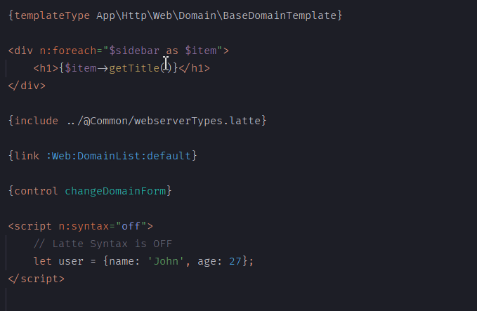

Latte for PhpStorm and IntelliJ IDEA
=========================================
[](https://plugins.jetbrains.com/plugin/24218-latte-support)
[](https://github.com/noctud/intellij-latte/actions)

[](https://discord.noctud.dev)

<!-- Plugin description -->
Provides comprehensive support for the [Latte](https://latte.nette.org) templating engine in PhpStorm and IntelliJ IDEA. Includes syntax highlighting, code completion, type-aware references via [{templateType}](https://latte.nette.org/type-system#toc-templatetype), navigation from `{link}` to presenter actions and `{control}` to components, live inspections, refactoring across Latte and PHP files, and configurable custom tags, filters, and functions per project.

If you have any problems with the plugin, [create an issue](https://github.com/noctud/intellij-latte/issues/new/choose) or join the [Noctud Discord](https://discord.noctud.dev).
<!-- Plugin description end -->




Notice
------------
This plugin is a fork of the [original free plugin](https://github.com/nette-intellij/intellij-latte). This fork has been created as another free plugin, since the code completion feature was removed from the original free plugin.


Installation
------------
Settings → Plugins → Browse repositories → Find "Latte Support" → Install Plugin → Apply


Installation from .jar file
------------
Download the `instrumented.jar` file from the [latest release](https://github.com/noctud/intellij-latte/releases) or the latest successful [GitHub Actions build](https://github.com/noctud/intellij-latte/actions)


Supported Features
------------------

* Syntax highlighting and code completion for PHP in Latte files
* Type-aware references to classes, methods, properties, and constants (via [{templateType}](https://latte.nette.org/type-system#toc-templatetype))
* Link references between `{link}` macros and presenter action methods
* Control component references from `{control}` tags to registered components
* File path references and missing file detection in `{include}` and `{import}` macros
* Refactoring support (rename classes, methods, variables across Latte and PHP)
* Live inspections (undefined variables, unknown classes/methods, deprecated tags, modifier issues, iterable types)
* Code folding, brace matching, and structure view
* Configurable custom tags, filters, functions, and variables per project
* Live templates for common Latte constructs
* Support for `{syntax off}`, `{syntax double}`, and `n:syntax` attributes


Exporting custom Latte definitions
------------

Copy [latte-xml-export.php](latte-xml-export.php) into your PHP project's `bin/` directory. It uses the project's existing Composer dependencies and requires Latte 3.0.4 or newer within 3.x, PHP 8.0 or newer, and `ext-dom`.

For a Nette application with `App\Bootstrap::boot()->createContainer()` and a registered `Nette\Bridges\ApplicationLatte\LatteFactory`, run from the project root:

```sh
php bin/latte-xml-export.php
```

This prints the XML for review. To update the IDE settings, **close the project in the IDE first**, then run:

```sh
php bin/latte-xml-export.php --output .idea/latte.xml
```

The output directory must already exist. Existing options, variables, unrelated components, and custom definitions absent from the export are preserved. Matching definitions receive inferred types and signatures, retaining manual descriptions, tag arguments, other attributes, and children. Removed PHP definitions are not automatically removed from XML; delete those entries manually. Regenerate when your extensions change, then reopen the IDE project.

For other application layouts, create a PHP bootstrap file returning the configured engine, for example `bin/latte-export-bootstrap.php`:

```php
<?php
// The project's Composer autoloader is already loaded.
$latte = new Latte\Engine();
$latte->addExtension(new App\Latte\MyExtension());
// Or obtain the engine from your application's container/factory here.
return $latte;
```

```sh
php bin/latte-xml-export.php --bootstrap bin/latte-export-bootstrap.php --output .idea/latte.xml
```

Use `--autoload path/to/vendor/autoload.php` for a nonstandard Composer location. The script runs your bootstrap, so it has the same initialization requirements and side effects as starting your application. Filters/functions registered directly on the returned engine are included; dynamic filter loaders and extensions registered later by a presenter are not discoverable from that engine.

The exporter retains the plugin's built-in Latte/Nette definitions unless overridden by custom callbacks. Paired tags are inferred from generator parsers (including `Extension::order()` wrappers), and filter hints omit the implicit filtered value and `FilterInfo` argument. Tag syntax with optional closing tags, allowed filters, and tag arguments cannot be fully inferred: review those settings in the IDE. An inferred tag type is refreshed on each export.

Based on [Jakub Vrána's original config generator (#12)](https://github.com/noctud/intellij-latte/pull/12).

To run the exporter's regression checks against a project with Latte installed:

```sh
php src/test/php/latte-xml-export-test.php /path/to/vendor/autoload.php
```

Contributing
------------

Bug reports with a small reproducible template are welcome. Please read the [contribution guide](CONTRIBUTING.md) before starting a PR, especially for parser or lexer changes.


Building
------------

```sh
./gradlew build
```

Testing in sandbox IDE
------------

```sh
./gradlew runIde
```
